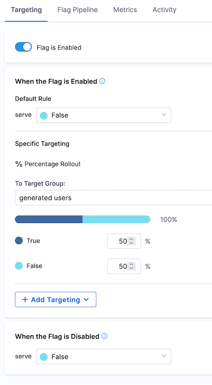

# Harness FF Bulk Test

Bulk evaluation of Harness Feature Flags for many targets to test bucketing.

## Setup

### On Your Local Machine

Export a variable called `HARNESS_SDK_KEY`. See details below to generate.

```bash
# required environment variables
export `HARNESS_SDK_KEY`=XXXXXXXX_XXXXX_XXXXXX_XXXXXXXXX

# optional variables

export `HARNESS_FEATURE_FLAG`=custom_flag
export `HARNESS_FEATURE_FLAG`=custom_flag

```

### Harness Configuration

1. Create a Target Group in Harness called `generated users`
   1. Edit the `critera` box to update Targed based on condition
   1. Add a new rule where `Identifier` contains `generated`
      
1. Create a boolean Feature Flag called `rolloutFlag`
   1. Default rule set to `false`
   1. When Disabled set to `false`
   1. Click `Add Targeting` > `Percentage Rollout` and choose the `generated users` Target Group
      

#### SDK Key

Generate a SDK key in the `Environments` tab in the Feature Flag tab.

Each SDK is tied to an environment. Additionally, each key is specified as a client-side or server-side application.

A minimum of one SDK is needed per environment. A minimum of two are needed to support frontend and backend applications per environment. Applications can share keys or use separate keys.

## Usage

```bash
python ./main.py
```

The application will stand up the Harness Feature Flag client and evaluate a flag randomly generated target every second.

The Identifier for target is between `generated-10000` and `generated-99999`.

### Ouput File

The `output.txt` file is a CSV with the flag name, Identifier and evaluation result.

### Log Files

The SDK provides detailed logs about the evaluation of flags.

- Targets being added to the generated_users segment
- Targets are caught by the Target Group rule. Targets not matching this rule are served false by default.
- Target is recognized to be evaluated against the Progressive Rollout rule
- Target is given an evaluation and assigned to a bucket (e.g., "38")
